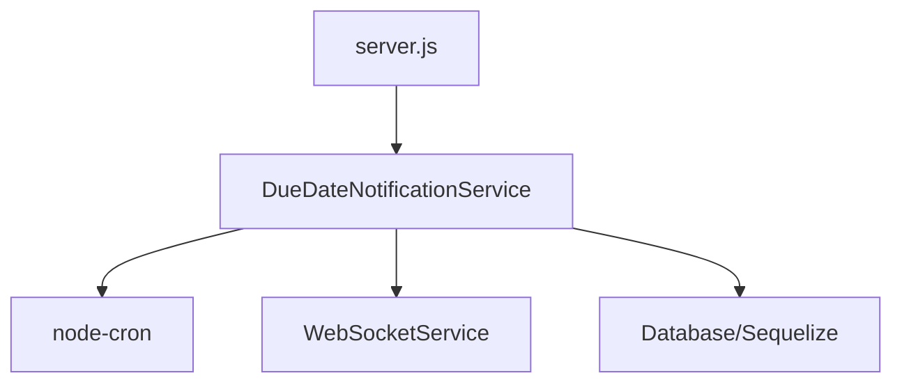

# Install Missing Module: node-cron

## Overview

The Tasket backend application is failing to start due to a missing dependency. The `dueDateNotificationService.js` module requires `node-cron` for scheduling due date notifications, but this package is not included in the project dependencies.

## Problem Analysis

### Error Details
```
Error: Cannot find module 'node-cron'
Require stack:
- /app/services/dueDateNotificationService.js
- /app/server.js
```

### Root Cause
1. The `dueDateNotificationService.js` file imports `node-cron` at line 1:
   ```javascript
   const cron = require('node-cron');
   ```
2. The `server.js` file initializes the DueDateNotificationService which triggers the import
3. `node-cron` is not listed in the `package.json` dependencies

### Impact
- Application fails to start in production environments
- Due date notification functionality is completely unavailable
- All scheduled tasks related to due dates will not execute

## Solution Design

### Approach
Add `node-cron` to the project dependencies in `package.json` and ensure proper installation.

### Implementation Steps

1. Add `node-cron` to dependencies in `package.json`
2. Install the package using npm
3. Verify the application starts successfully
4. Test the due date notification functionality

### Required Changes to package.json

Add the following line to the dependencies section of `package.json`:

```json
"node-cron": "^3.0.3"
```

### Technical Details

#### Package Information
- **Package Name**: node-cron
- **Version**: Latest stable version (currently ^3.0.3)
- **Type**: Production dependency
- **Usage**: Scheduling cron jobs for due date notifications

#### Implementation in package.json
The dependency should be added to the `dependencies` section:
```json
"dependencies": {
  "node-cron": "^3.0.3",
  // ... other dependencies
}
```

#### Cron Job Schedules
The service uses two cron schedules:
1. Daily at 9:00 AM: `0 9 * * *` - Checks for tasks due in 3 days
2. Hourly: `0 * * * *` - Checks for urgent tasks due within 24 hours

## Architecture

### Component Integration


### Data Flow
1. Server initialization loads DueDateNotificationService
2. Service sets up cron jobs using node-cron
3. Cron jobs periodically query the database for upcoming due dates
4. Notifications are created and sent via WebSocketService

## Dependencies

### New Dependencies
- `node-cron`: ^3.0.3 - For scheduling background tasks

### Existing Dependencies Utilized
- `sequelize`: For database queries
- `socket.io`: For real-time notifications
- Express application infrastructure

## Testing Strategy

### Unit Tests
1. Verify cron job registration
2. Test due date calculation logic
3. Validate notification creation process

### Integration Tests
1. Confirm application starts without module errors
2. Verify cron jobs execute at expected intervals
3. Test end-to-end notification flow

### Manual Verification
1. Start the application successfully
2. Observe cron job initialization in logs
3. Confirm scheduled tasks execute as expected

### Verification Commands
```bash
# Install the new dependency
npm install node-cron

# Or install all dependencies including the new one
npm install

# Start the application
npm start

# Check logs for successful cron job initialization
# Look for: "Running daily due date check..."
# Look for: "Running hourly urgent due date check..."
```

## Deployment

### Installation Commands
```bash
# Add the missing dependency
npm install node-cron

# Or install all dependencies including the new one
npm install
```

### Environment Requirements
- Node.js >= 18.0.0 (as specified in package.json)
- npm >= 9.0.0

### Docker Deployment
For Docker deployments, rebuild the image after adding the dependency:
```bash
# Build the Docker image
docker build -t tasket-backend .

# Run the container
docker run -p 5000:5000 --env-file .env tasket-backend
```

### Rollback Plan
If issues occur after deployment:
1. Revert package.json to previous version
2. Run `npm install` to remove the new dependency
3. Deploy the reverted version

### Troubleshooting

#### If the application still fails to start:
1. Check that `node-cron` was added correctly to package.json
2. Verify all dependencies are installed:
   ```bash
   npm list node-cron
   ```
3. Clear npm cache and reinstall:
   ```bash
   npm cache clean --force
   rm -rf node_modules package-lock.json
   npm install
   ```

#### If cron jobs are not executing:
1. Check application logs for cron initialization messages
2. Verify system time and timezone settings
3. Test cron syntax using online cron expression validators

## Security Considerations

### Dependency Security
- `node-cron` is a well-maintained, widely-used package
- Regular security audits should be performed on all dependencies
- Monitor for security advisories related to node-cron

### Cron Job Security
- Cron jobs execute with the same privileges as the application
- Database queries are properly parameterized to prevent injection
- No user input is directly used in cron job scheduling

## Performance Impact

### Resource Usage
- Minimal memory overhead for cron job scheduling
- Database queries are optimized with proper WHERE clauses
- WebSocket notifications are sent only when necessary

### Scalability
- Cron jobs will execute on each application instance
- In a multi-instance deployment, consider using a dedicated job scheduler
- Database queries use indexes for efficient due date lookups

## Conclusion

The missing `node-cron` module is a critical dependency for the due date notification functionality. Adding this dependency to the project will resolve the startup error and restore the scheduled notification features. The fix is straightforward and involves adding the module to package.json and running npm install.

This solution maintains backward compatibility and follows the existing project architecture patterns. No code changes are required in the application logic, only the dependency installation.
